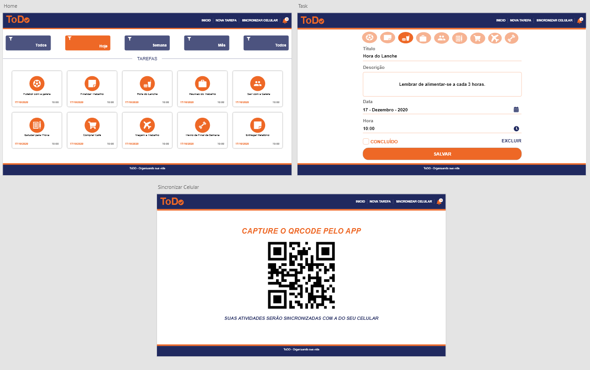

<h1 align="center">
  
</h1>

<h4 align="center">Aplicação mobile desenvolvida para lhe ajudar a lembrar de suas atividades diárias.</h4>

<p align="center">
  <a href="#como-executar">Como executar</a> •
  <a href="#funcionalidades">Funcionalidades</a> •
  <a href="#a-desenvolver">A desenvolver</a>
</p>

<h1 align="center">
  
</h1>

## 💻 Projeto
Aplicativo para lhe ajudar a lembrar de suas atividades diárias.

## 👥 User Stories
O João e uma pessoa muito atarefado é péssimo em organização pessoal, sempre se esquecia de suas tarefas ou de seus compromissos com os amigos e o trabalho,
até de fazer compras no mercado se esquecia.
Então que tal ajudá-lo a lembrar das suas tarefas? 
Ou seja, o App ajuda o João a lembrar de seus compromissos. ❤️

## ⚙ Features
-   [x] Salva as tarefas do usuário;
-   [x] Atualiza tarefas já registradas;
-   [x] Alterar o status da tarefa para concluída ou não concluída;
-   [x] Mostrar as tarefas atrasadas;
-   [x] Mostrar as tarefas de hoje, semana, mês ou ano;
-   [x] Sincroniza as tarefas da versão web com a versão mobile;

## ✨ Tecnologias
-   [x] React
-   [x] ReactDom
-   [x] React Qrcode
-   [x] Axios
-   [x] Date Fns


## 🛢 BackEnd

*Antes de rodar o App ou a versão Web baixe a base de dados.*
* [BackEnd_ToDo](https://github.com/Caiovg/ToDo_back.git)


## 📱 Versão Mobile

* [Mobile_ToDo](https://github.com/Caiovg/ToDo.git)

## 💻 Executando o projeto

### Requisitos

- [Node.js](https://nodejs.org/en/)
- [Expo](https://expo.io/)  
- [Yarn](https://classic.yarnpkg.com/) or [NPM](https://www.npmjs.com/)

### Instalando e executando o projeto

*Clone o projeto e acesse a pasta*
-   [x] React
```bash
$ https://github.com/Caiovg/ToDo.git 
$ cd ToDo_web
```

*Siga os passos abaixo*

```bash
# Instale as dependências
$ yarn install

$ yarn start
# Muito bem, ToDo foi iniciado!
```
<br>
